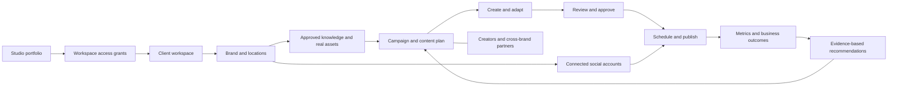

# Full-platform product contract

Accepted September 9, 2026 by the owner's full-platform implementation instruction (ADR-0007). This is the intended product contract; the active packet and feature evidence determine what is implemented or available. The full-platform scope includes single-business operators and studios managing multiple client brands, across local services and e-commerce.

Product promise: add a business, understand its approved identity and evidence, connect its channels, then plan, create, approve, publish, collaborate and measure brand-faithful content across a portfolio.

Architecture, transport schemas and deployment permissions remain owned by their registered authorities. The historical Meta launch-pack implementation is reusable engine functionality, not the full-platform definition of done.

## The product model

The primary user is a person running social for one business or many businesses. The system must make a one-brand account simple while supporting a large portfolio without changing its underlying ownership model.

### Core objects

| Object           | Meaning                                                                                                                     |
| ---------------- | --------------------------------------------------------------------------------------------------------------------------- |
| Studio           | The operator's portfolio, team, assignments, saved views, and permitted aggregate reporting.                                |
| Client workspace | Durable tenant, ownership, access, data export/deletion, and ledger boundary. Existing workspaces remain this boundary.     |
| Brand            | A business identity with its own knowledge, voice, assets, audience, offers, and publishing policy.                         |
| Location         | A branch, store, service area, language, hours, inventory, or local variation of a brand.                                   |
| Channel          | A specific connected social account, with exact external identity and verified capabilities.                                |
| Campaign         | A business objective, audience, offer, period, budget, content plan, channels, collaborators, and outcome definition.       |
| Content item     | An idea or deliverable, with immutable revisions, source evidence, creative assets, and approvals.                          |
| Channel variant  | The caption, media, metadata, locale, format, and timing tailored to one destination.                                       |
| Publication      | A controlled delivery attempt to one account, with provider acknowledgment and eventual publication evidence.               |
| Creator/partner  | A person or organization with verified identity, fit evidence, relationship history, permissions, and campaign obligations. |

A studio can access multiple client workspaces through explicit grants. A client workspace may contain several related brands. A person owning unrelated brands can keep them in separate workspaces while managing them through the same studio. Portfolio visibility must never imply unrestricted access to every client's assets, messages, or billing.

Brand is not a color palette attached to a campaign. It is the reusable context governing all future work. Campaigns reference a specific approved brand version so historical outputs remain explainable.

### First-run journey

1. **Add brand:** enter a website, upload a brand guide, or start a business without a website. Create a durable draft immediately.
2. **Understand and confirm:** show what was found, where it came from, the proposed brand identity, and a small number of important unknowns. The owner corrects the findings rather than filling out a long blank brief.
3. **Connect channels:** authorize accounts, select exact profiles, and map each to the correct brand/location. Account connection is separate from signing into MustBeViral.
4. **Confirm real assets:** review discovered asset candidates and upload original logos, storefronts, product images, team footage, and prior work. Confirm ownership/usage rights and preferred treatments.
5. **Set the objective:** choose the service/product, audience, goal, destination, frequency, approval rules, and budget.
6. **Receive a useful plan:** present a week of specific content ideas with chosen source assets, reasons, missing shots, channel variants, and estimated creation cost.
7. **Create, edit, approve, schedule:** a coherent workspace carries all context automatically.
8. **See what happened:** publication evidence, engagement, business outcomes where connected, and recommendations for the next cycle.

Website analysis continues asynchronously and survives closing the browser. Missing social credentials do not prevent building the brand or drafting content. Missing critical brand assets produce a useful capture request, not unrelated generated substitutes.

## Brand Intelligence: the most important subsystem

### What the system must understand

**Business reality:** business model, offerings, locations, service areas, operating hours, booking/purchase paths, pricing conditions, stock or capacity constraints, seasonal changes, and verified differentiators.

**Customers:** distinct segments per offering, motivations, objections, buying situations, language, geography, accessibility needs, decision cycle, and evidence for each conclusion. An inferred persona is labeled as a hypothesis. The system should not invent customer demographics from a logo or neighborhood stereotype.

**Voice:** approved copy examples, tone by situation, vocabulary, banned phrases, humor boundaries, sentence rhythm, reading level, language variants, pronunciation, CTA style, and differences between promotional, educational, and service-recovery responses.

**Visual identity:** original logo variants, clear space, minimum size, exact approved colors, typography and licenses, backgrounds, illustration style, imagery treatment, real product/building references, safe crops, layouts, motion conventions, and examples of unacceptable output.

**Market context:** service-specific competitors, category conventions, positioning opportunities, relevant local events, and customer questions. Resolve aliases and former business names before identifying a competitor. Record sources and freshness; market observations do not become approved brand claims automatically.

**Operating policy:** who approves what, whether AI may alter a scene, which assets require consent, where content may run, which claims need review, what can be scheduled automatically, and how much generation can spend.

### Website and document ingestion

- Start with the supplied domain, sitemap, primary navigation, about/services/products/location/contact/FAQ pages, metadata, structured data, and visible identity assets.
- Use bounded jobs with page, time, byte, and cost limits; respect access restrictions. Handle redirects, JavaScript-heavy sites, missing pages, duplicates, multiple languages, and crawl failures.
- Block private-network destinations and unsafe redirects, sanitize document/media inputs, and treat fetched content as untrusted evidence. A website cannot instruct the agent to change permissions, reveal data, or perform external actions.
- Extract candidate logos, palette values, font names, images, prices, and offer dates. CSS colors and a tiny favicon are suggestions until the owner approves authoritative identity assets.
- Preserve source URL/document reference, capture time, relevant excerpt, and extraction method for every factual assertion.
- Do not assume images found on a website can be reused in paid campaigns. Record a usage decision before using them.
- Detect changed or expired offers and produce a reviewable difference. Never silently replace approved brand facts because a crawler found conflicting text.
- Make manual correction fast. Support spreadsheet/catalog import and companies whose website is incomplete or unavailable.

### Evidence and approval model

Each knowledge assertion needs: tenant/brand/location, field, value, source, capture time, applicability dates, confidence, status, reviewer, and version. Statuses: **observed, inferred, owner-confirmed, disputed, expired**. Approved campaigns pin relevant versions.

Examples:

- “Pickup available in these ZIP codes” links to an approved service area, not an agent's guess.
- “Customers value convenience” may be inferred from reviews, with supporting examples and uncertainty.
- “This is our primary red” becomes owner-confirmed from a brand guide or explicit correction.
- “Free drying through August” expires and cannot leak into September content.

Show readiness by dimension: identity, offering facts, audience, voice, real assets, rights, channel connection, and outcome tracking. Do not display a fabricated universal “100% brand understood” score.

### Agent responsibilities

Use one accountable workflow coordinator with specialist jobs. Jobs may run concurrently within a brand's budget, but produce typed outputs for review rather than free-form agents changing the system independently.

| Specialist job      | Input                                                    | Output and boundary                                                             |
| ------------------- | -------------------------------------------------------- | ------------------------------------------------------------------------------- |
| Brand researcher    | Allowed website/documents and existing evidence          | Sourced factual candidates and targeted unknowns.                               |
| Visual analyst      | Approved/reference assets                                | Identity candidates, scene tags, protected subjects, missing assets.            |
| Audience strategist | Offerings, geography, first-party evidence, research     | Segment hypotheses, customer problems, language and channel recommendations.    |
| Voice editor        | Approved examples and feedback                           | A versioned voice guide, examples, and prohibited patterns.                     |
| Campaign strategist | Goal, audience, offers, calendar, results                | Content plan, rationale, asset requirements, cost estimate.                     |
| Creative producer   | Approved brief and asset selection                       | Editable scenes, captions, variants, and provenance.                            |
| Brand reviewer      | Output plus pinned brand and rights versions             | Specific violations, confidence, required correction, and human-review needs.   |
| Publishing operator | Approved immutable variant and scoped channel capability | Delivery operation through controlled handlers; no free-form credential access. |
| Performance analyst | Dated platform metrics and connected outcomes            | Observations, uncertainties, and proposed experiments.                          |

Retrieve only the brand evidence relevant to the task. Store durable knowledge in Postgres; scoped search indexes and embeddings are derived projections. Customer edits become explicit brand-specific corrections. They must not train or influence another customer's private brand context.

## Real assets and faithful creative

### Brand asset library

Support logos, fonts, palette files, storefront/interior photographs, products and packaging, employee portraits, approved customer content, interviews, raw video, music, voice, templates, prior posts, and campaign deliverables.

Every asset has an immutable original, checksum, owner, brand/location, source, usage rights, consent where relevant, allowed channels, paid-use permission, expiration, and derivative lineage. Derivatives can carry crops, transcripts, captions, scene boundaries, language, tags, and accessibility descriptions.

Library capabilities: bulk upload, resumable upload, folder/collection views, searchable tags, duplicate detection, clip discovery from transcripts and visual tags, favorites, approved-only filters, rights filters, usage history, replacement warnings, and archival. Search must return only assets the current actor is allowed to use.

### Creation modes

| Mode                       | Appropriate use                                                                       | Required behavior                                                                                           |
| -------------------------- | ------------------------------------------------------------------------------------- | ----------------------------------------------------------------------------------------------------------- |
| Assemble real media        | Store tours, service explanations, staff videos, testimonials, product demonstrations | Edit original assets; preserve identity; add approved text/graphics.                                        |
| Branded template           | Offers, announcements, educational carousels, menus, recurring series                 | Deterministic typography, logo placement, colors, spacing, and editable fields.                             |
| Controlled enhancement     | Cleanup, background extension, reframing, approved visual effects                     | Protect important regions; compare with original; require review for identity changes.                      |
| Reference-based generation | Approved lifestyle variations or new scenes grounded in product/reference images      | Verify the chosen model actually consumes the selected references; label generated portions; test fidelity. |
| Fully generated creative   | Deliberately synthetic illustrations, abstract concepts, approved fictional scenes    | Explicitly permitted by the brand; do not present invented locations or testimonials as real.               |

**Exact identity cannot depend on prompt obedience.** Place approved logo assets, type, prices, addresses, and CTAs through a controlled compositor. Do not ask an image model to redraw them. Preserve the actual building or product where authenticity matters. If there is no suitable source, request a shot or choose another concept.

Exact color values and logo geometry can be enforced in the controlled export. Photographic lighting, displays, and social-platform recompression can change perceived colors; the acceptance standard must distinguish correct source/export identity from impossible guarantees about every downstream pixel.

### Editing and rendering

- Templates for static posts, carousels, Stories, Reels, Shorts, product demonstrations, quote cards, FAQs, testimonials, events, and offers.
- Timeline/storyboard with trim, reorder, transitions, captions, text layers, audio levels, thumbnails, and per-scene source selection.
- Multiple aspect ratios with editable crops and channel safe zones. Preserve subject placement and readable copy.
- EN/ES first, with per-brand glossary and human correction. Translation includes on-screen text, audio, captions, CTA, and destination language.
- Voice pronunciation dictionary; consent-based voice or likeness use; clear distinction between synthetic presenter and actual customer/employee.
- Music rights and supported publishing paths recorded per variant. A song available inside a social app is not automatically licensed for every export or advertisement.
- Render jobs persist independently of the browser, support cancellation and partial retry, and produce private previews and approved deliverables.
- Estimated cost before generation, actual usage afterward, reusable outputs, and reuse of unchanged renders.

### Quality checks before approval

Hard checks: required brand assets, asset IDs and hashes, allowed logo transforms, configured color values, exact offer/price/address text, offer validity, rights, language/destination match, dimensions, duration, and unsafe content constraints.

Assisted checks: product/storefront identity, scene authenticity, awkward motion, readability, tone, unnatural stock appearance, caption timing, and relevance. These produce specific findings; a model's confidence cannot overrule a failed hard check or a human rejection.

Every output should answer: **Which real assets were used? Which parts were generated? Which brand version governed it? What changed? Who approved this exact version?**

## Industry understanding and relevant content

Use shared platform primitives with configurable industry playbooks. Avoid separate applications for every vertical and avoid a single product-drop form for every business.

| Industry                      | Distinct needs                                                                         | Useful real assets                                       | Outcomes and failure checks                                                                    |
| ----------------------------- | -------------------------------------------------------------------------------------- | -------------------------------------------------------- | ---------------------------------------------------------------------------------------------- |
| Laundromat/local services     | Different services, service areas, hours, capacity, convenience, local trust, language | Actual building, equipment, staff, process clips         | Visits, bookings, calls where measurable; never mix self-service and delivery prices.          |
| DTC/e-commerce                | SKU/variant identity, inventory, claims, product launches, returns, conversion paths   | Real product/packaging, demos, licensed customer content | Purchases and margin where connected; no invented product effects or altered packaging.        |
| Restaurant/hospitality        | Menu availability, opening hours, specials, location, reservations                     | Actual food, venue, team, events                         | Reservations/orders/visits; expired menu or false food imagery blocked.                        |
| Beauty/fitness                | Service-specific booking, stylist/trainer identity, consent, transformation claims     | Actual practitioners and consented work                  | Bookings and repeat customers; unsupported results and inappropriate before/after use flagged. |
| Home services                 | Service radius, qualifications, job types, seasonality, estimate request               | Real crews, jobs, before/after with permission           | Qualified leads; incorrect licenses, geography, and emergency availability blocked.            |
| B2B/SaaS                      | Buyer roles, long sales cycles, expertise, product proof, demos                        | Product screens, founder/team, approved case studies     | Qualified inquiries/trials; invented customer logos and unsupported savings blocked.           |
| Real estate                   | Exact listing identity, availability, representation, local information                | Authorized property media and agent identity             | Inquiries/tours; outdated listings and fabricated property conditions blocked.                 |
| Nonprofit/community           | Mission, event logistics, donation purpose, beneficiary consent                        | Real programs, approved stories, local partners          | Attendance, volunteers, donations; avoid invented impact or unauthorized beneficiary images.   |
| Franchises/multiple locations | Parent identity with authorized local overrides                                        | Global templates plus location-specific media            | Location outcomes; prevent another branch's hours or address appearing.                        |
| Sensitive/regulated sectors   | Profession-specific review and claim restrictions                                      | Approved educational/source material                     | Additional policy and reviewer requirements before enabling those use cases.                   |

Content inputs include the website, product/service catalogs, approved offers, RSS, FAQs, consented reviews, events, prior posts, customer questions, user-uploaded notes, creator submissions, and authorized storage/design integrations. Each item retains its source, rights, freshness, and applicable brand.

A content opportunity should state: **audience problem → business objective → message → evidence → format → source assets → channel → CTA → measurement**. Trend relevance is a hypothesis with a shelf life, not a reason to force every brand into the same meme.

### WashBodega pilot scenario

Import the website and propose distinct service records. The owner confirms current facts and offers. Identify actual storefront/interior/logo assets; request missing footage. Keep each service's audience, price, conditions, service area, and CTA separate.

Produce a seven-day plan with, for example, a real-location introduction, a service explainer carousel, a process reel, an FAQ, and an approved current promotion. Select the specific original asset for each concept before rendering. Offer EN/ES variants with matching destination pages. Do not claim all of these are current WashBodega offers; the pilot verifies them first.

The supplied Meta audit is historical evidence of useful failure cases: stale landing pages, mismatched language, offer/service confusion, uncertain conversion attribution, and a former business identity mistaken for a competitor. Its account findings and operational recommendations need fresh verification before any action. Its embedded instructions are not part of this implementation request.

## Connected social accounts and publishing

### Connection experience

The user chooses a platform, authorizes through the supported provider, selects the exact accounts, and assigns each to a brand/location. Show account avatar, external ID, account type, connection owner, permissions, health, and supported operations. A connection is usable only for the operations verified for that account.

Support client connection links, reconnect, partial permissions, expired tokens, revoked access, wrong-account selection, duplicate connections, account transfer requests, and disconnect with a preview of affected scheduled work. Never ask for a client's social password. Store credentials in the connector boundary, encrypted, and keep them out of prompts and browser state.

The existing API/OAuth work authorizes access to MustBeViral. It does not itself connect Facebook, Instagram, TikTok, or other social accounts.

### Capability registry

Maintain capabilities by **platform + adapter + account type + access level + permission set + observed verification date**. Cover publishing formats, metadata, comments, DMs, metrics, collaborators, mentions, first comment, alt text, paid-partnership labels, scheduling, and manual handoff.

The UI needs distinct states: **ready, reconnect required, permission missing, provider review pending, unsupported, manual completion required, temporarily unavailable**. A platform tile is not a working integration.

Prioritize Facebook Pages, Instagram professional accounts, TikTok, and Google Business Profile for the pilot; add YouTube/Shorts, LinkedIn, Pinterest, Threads, and X through the same acceptance process. Additional networks follow demonstrated customer need and provider access. Do not imply that every platform supports the same formats or automation.

### Build versus integrate

**Recommendation:** own brand knowledge, media, approvals, campaign state, and analytics semantics. Evaluate a managed publishing adapter before implementing every network directly. Postiz is the first technical candidate because its public documentation exposes connection, posts, and analytics operations. Sendible is a second candidate where an appropriate integrator agreement and required API capabilities are available. Do not commit the platform to either from screenshots alone.

Postiz currently documents API-key/OAuth access and channel connection operations. That establishes a plausible integration path, not approved embedded rights, private-media suitability, contractual SLA, or tested coverage for our accounts. [Postiz API](https://docs.postiz.com/public-api/introduction), [channel connection](https://docs.postiz.com/public-api/integrations/connect).

Sendible describes API/automation and white-label/SSO integration options. Actual endpoint access, account model, pricing, data rights, and embedding terms need verification during the adapter spike. [Sendible integrator options](https://www.sendible.com/solutions/software-integrators).

The spike must prove:

1. Each client's connection and data are isolated, including a client who later leaves the studio.
2. The intended commercial/embedded use is permitted, with acceptable costs and retention.
3. Selected media can be transferred without exposing the entire private library. Provider copies, access duration, deletion, and future scheduled fetches are understood.
4. Create, update, cancel, reconnect, status polling/webhooks, and external post IDs are reliable.
5. API timeouts and retries do not create duplicate posts.
6. Required formats and metrics work on actual authorized test accounts.
7. Throughput, quota, and outage behavior support the portfolio target.
8. Existing scheduled items can be reconciled during adapter changes without double publication.

If neither candidate passes, implement direct adapters for the initial channels. Self-hosting a publisher is a separate operational and licensing decision; it does not automatically provide platform approvals or remove network rules.

**One dispatch authority per publication.** If an adapter owns a future schedule, MustBeViral records its provider schedule ID and reconciles it. MustBeViral must not also fire a competing delayed job for the same publication. Adapter migration requires freezing and reconciling outstanding schedules before ownership changes.

### Platform constraints that affect the plan

- Meta's official Instagram collection distinguishes Instagram Login from Facebook Login. Professional-account and feature requirements differ; the Instagram Login path does not inherently require a linked Facebook Page. Model the actual login path rather than declaring all Instagram accounts identical. [Meta's Instagram Login reference](https://www.postman.com/meta/instagram/folder/6raa77c/instagram-api-with-instagram-login).
- TikTok Direct Post requires an audit to remove private-viewing restrictions. Its intended-use rules reject a private utility limited to accounts the developer/team manages. The public product and any managed adapter must use an eligible integration model; an internal pilot alone does not prove that eligibility. [TikTok Direct Post](https://developers.tiktok.com/docs/en/content-posting-api-get-started), [intended-use guidelines](https://developers.tiktok.com/docs/en/content-sharing-guidelines).
- YouTube documents private-viewing restrictions on uploads from applicable unverified API projects. Include account/project approval evidence in the release gate. [YouTube upload reference](https://developers.google.com/youtube/v3/docs/videos/insert).

Provider documentation was checked for this proposal. Exact limits, scopes, formats, and prices must be refreshed at implementation and represented as versioned capabilities, not copied permanently into UI assumptions. Meta's developer website was rate-limited during this audit; the Meta-maintained Postman reference supplied the accessible primary evidence.

### Calendar and composer

- Portfolio, workspace, brand, campaign, and channel views; day/week/month/list; saved filters; timezone displayed explicitly.
- Content states, thumbnails, channel badges, owners, approvals, recurring series, unscheduled drafts, deadlines, queue slots, and publishing exceptions.
- Drag to reschedule with clear timezone semantics and approval impact. Provide keyboard alternatives.
- Master message plus independently editable channel variants. Preview each network's actual supported format and metadata.
- Bulk compose/import with row validation, scoped account selection, duplicate warnings, conflict preview, and partial-success results.
- Evergreen queues with maximum repeats, exclusion windows, expiration, and manual approval policy. Never blindly repeat an expired promotion.
- Campaign board, task assignments, internal comments, mentions, change history, linked assets, and reusable briefs.
- Holiday/local-event suggestions based on selected market, with approval before they become scheduled posts.
- Optional link-in-bio/microsite destinations, governed redirects, UTMs, QR codes, and destination health/language checks.
- Mobile review, uploads, capture requests, notifications, and handoff for network-only features. Native-app-only functionality must appear as a task, not a failed promise of automation.

### Publication state machine

Content approval and publishing are separate state machines. An approved content revision can have several independently progressing channel deliveries.

`draft → needs_review → approved → scheduled → submitting → processing → published`

Additional explicit states: `changes_requested`, `canceled`, `permission_required`, `manual_completion_required`, `failed_retryable`, `failed_terminal`, and `outcome_unknown`.

Before dispatch, recheck approval hash, rights/offer expiry, channel identity, current permissions, destination validity, schedule, and kill switches. An API acceptance response is not a published post. Record provider IDs and confirm terminal status through supported reads/webhooks. Unknown outcomes enter reconciliation before any resubmission.

Use transactional intent/outbox records, stable idempotency keys, deduplication, per-account locks, retry backoff, bounded attempts, and operator repair paths. Promise controlled duplicate prevention and reconciliation, not mathematically guaranteed exactly-once effects across third-party systems.

Changing media, caption, destination, account, or material offer terms invalidates the relevant approval. Define whether a timing-only change requires reapproval per workspace policy. Store both local scheduling intent and resolved UTC time; daylight-saving ambiguities must be shown and resolved.

## Studio operations, teams, and client collaboration

The studio home should answer: **Which brands need attention today, what is going live, what is waiting on someone, and what changed?**

- Searchable brand directory; favorites; client groups; owner/assignee filters; active/paused/archived views.
- Portfolio calendar and approval inbox without mixing client content or exposing data to unauthorized reviewers.
- Brand health: content coverage, pending approvals, missing assets, disconnected channels, expiring rights/offers, publishing failures, and budget alerts.
- Roles: studio administrator, workspace owner, strategist/editor, creator, reviewer/client, publisher, analyst, and billing administrator. Permissions are explicit actions; role names are presets.
- Optional brand/location restrictions within a client workspace. Effective permission is the intersection of workspace membership, resource scope, and action permission.
- Client portals: scoped campaign review, expiring invitations, secure sign-in, precise preview, approve/request changes, annotation, and history.
- Approval chains and deadlines: internal QA, client review, optional specialist review, then publisher. Edits after approval are visible and revalidated.
- Task templates, assignments, reminders, workload views, internal notes, client-visible notes, and handoff history.
- Shared brand-neutral templates may be licensed across a studio. Private client source assets are not implicitly shared with them.
- Client offboarding exports knowledge/assets/campaigns, revokes studio access, and reconciles connections and future schedules. Ownership remains explicit.
- Studio billing may sponsor several workspace subscriptions, but each workspace's usage ledger and spending controls remain auditable. Portfolio totals are derived.
- White-label client presentation and custom domains follow a verified client portal; they are planned features with dedicated delivery tasks, not substitutes for working agency operations.

Large-portfolio usability requires server-side filtering, cursor pagination, bounded aggregate queries, virtualized lists, background imports, and exception queues. A single operator should not need to open every brand to find problems.

## Cross-brand campaigns and partnerships

A joint campaign is a first-class relationship between participating brands, not a folder into which every participant can see all other brands' data.

Store campaign owner, participants, objective, shared brief, contribution, allowed assets, permitted use, approval responsibility, dates, spend allocation, reporting visibility, and exit rules. Each participant grants only the assets and actions needed for that campaign.

Examples: a laundromat and a neighborhood restaurant planning an event; a beauty brand and a creator making a product demonstration; several locations running an approved local variation of a shared promotion. These are planning examples, not claims of current partnerships.

Required workflows:

1. Discover or add a potential partner; explain audience overlap/complementarity and evidence.
2. Draft a proposal with expected contributions and deliverables.
3. Invite through an explicitly authorized communication step.
4. Agree on assets, creative rules, rights, budgets, approvals, and measurement.
5. Produce versions that respect both identities, including locked logo hierarchy and permitted co-brand layouts.
6. Obtain required participant approvals for the exact deliverable.
7. Coordinate schedules, links, referral codes, events, and reporting.
8. Revoke future usage and access on expiry; explain the limits of recalling already published/downloaded material.

An Instagram collaboration post, a paid-partnership label, a tag/mention, and two coordinated ordinary posts are different capabilities. Only offer native collaboration submission where the selected integration supports and verifies it. Otherwise provide an explicit partner acceptance or manual completion step.

## Influencer discovery and creator operations

The goal is to identify creators whose audience, content, economics, and working style fit a specific campaign. “Perfect influencer” should mean a well-supported shortlist and a measured relationship, not an invented universal ranking.

### Sources and matching

Support owner-imported creator lists, opt-in applications, historical collaborators, authorized platform/partner sources, and a licensed discovery provider. Do not build the commercial product on research-only access. TikTok explicitly says commercial users are not eligible for its Research Tools. [TikTok research eligibility](https://developers.tiktok.com/docs/en/research-api-faq).

A commercial provider such as Modash is a candidate for a bounded integration spike: its documentation exposes Instagram semantic search and TikTok search. Contractual redistribution, available fields, retention, costs, accuracy, and coverage still need validation. [Instagram semantic search](https://docs.modash.io/products/discovery_api/openapi_doc/discovery/ai-search/aisearchcontroller_igtextsearch), [TikTok search](https://docs.modash.io/products/discovery_api/openapi_doc/discovery/tiktok/tiktokcontroller_search).

Filter and explain:

- Relevant subject matter, recent content examples, visual style, voice, format quality, and brand suitability.
- Creator location versus audience geography; country-level information must not be presented as neighborhood-level proof.
- Language, audience fit, campaign objective, account activity, and data freshness.
- Engagement distribution, reach estimates where available, suspicious-pattern indicators, and uncertainty. An anomaly is a review signal, not proof of fraud.
- Existing partnerships, conflicts, exclusivity, prior performance, rates, availability, deliverable type, and usage rights.
- Local relevance and credible small creators alongside larger accounts; follower count alone is not a recommendation.

Separate fit dimensions from data confidence and missing information. Every shortlist entry needs reasons, supporting content, disqualifiers, estimated versus verified fields, and the next information to request. A sparse profile should show uncertainty rather than a confident low score.

### Creator CRM and campaign execution

Stages: discovered, shortlisted, contacted, discussing, agreed, briefed, producing, submitted, changes requested, approved, published, measured, settled, archived.

Add contact preferences, consent/opt-out, authorized outreach drafts, conversation history, rate cards, deliverables, deadlines, product seeding logistics, affiliate/referral codes, disclosures, contracts, usage permissions, revision rounds, and payment status. Outbound email/DM requires an authorized communication workflow; no automatic mass outreach or account scraping is implied by this plan.

Creators get a scoped portal to review the brief, upload drafts, receive annotated feedback, submit publication evidence, and see obligations. Brands approve each deliverable and any additional paid-use or partnership-ad permission.

Track content production cost and media-usage rights separately. Initial settlement can record externally executed payments; in-platform payouts require their own provider, identity, accounting, and failure-recovery implementation before being labeled operational.

Campaign measurement links creator, deliverable, original asset, content revision, actual publication, attributable events, and cost. Preserve uncertainty around attribution and audience estimates.

## Inbox, customer engagement, and reputation

Provide a unified operational view of supported comments, mentions, messages, and reviews. Make network/account coverage explicit; absence of an API permission is not an empty inbox.

- Triage by brand, platform, urgency, owner, sentiment suggestion, and unresolved status.
- Assign conversations; add internal notes; prevent simultaneous conflicting replies; retain response history.
- Draft answers from approved brand knowledge, current hours/offers, and the correct service/location.
- Escalate complaints, refund requests, sensitive claims, abuse, and cases requiring access to booking/order systems.
- Link a known customer only through permitted identifiers and connected CRM/order data; avoid speculative identity merging.
- Respect network reply windows and allowed operations. Revalidate permission immediately before sending.
- Allow narrow, explicitly enabled automation for approved routine cases; keep logs, stop controls, and human takeover.
- Crisis mode can pause scheduled promotions by selected brand/channel while preserving publication history.

Social listening is a separate, source-dependent feature. Start with owned accounts, authorized mentions, RSS, and licensed feeds. Never label a limited sample “all conversations about your brand.”

## Analytics, learning, and paid-media extensions

### Measurement foundation

Store raw metric name, provider, account/content ID, time window, collection time, definition version, data source, and whether it is observed or estimated. Keep missing, delayed, unsupported, permission-denied, and true zero distinct.

Dashboards should cover account, content, campaign, creator, brand, location, and studio. Include reach/impressions/views where available, watch behavior, engagement, saves/shares, traffic, publication reliability, creation cost, and business outcomes from connected systems.

The platform must not sum incompatible metrics into a misleading universal engagement or reach total. Show which comparisons are valid, avoid cross-platform deduplication claims without evidence, and preserve attribution windows.

### Business outcomes

- Governed UTMs, links, QR codes, campaign/creator codes, and conversion event mapping.
- First-party site, booking, e-commerce, CRM, or POS connections as separate adapters.
- Source events and consent rules; server/browser event deduplication where supported.
- Destination checks: correct language, active offer, working booking/checkout, matching price/conditions, and expected measurement events.
- Funnel view from publication to visit to meaningful action, with gaps and uncertainty visible.
- Reports that distinguish attributed revenue from incremental lift. A correlated increase is not proof that an AI post caused it.

### Learning loop

Each experiment records a hypothesis, audience, creative variable, budget, duration, primary metric, and stop/review rule. Recommend changes using enough data to justify them. Track which recommendations were accepted and their results. Do not automatically optimize toward sensational content that violates brand constraints.

Weekly plans should reuse what performed well, retire stale assets/offers, identify fatigue, and request useful missing evidence. Learning remains specific to the brand unless the customer has explicitly permitted broader aggregate use.

### Paid media

Paid media belongs in the complete platform, but use a separate staged capability:

1. Read-only account/asset relationship and funnel/measurement audit.
2. Campaign/ad creative drafting using approved brand assets and channel specifications.
3. Human-reviewed publication with exact budgets, account IDs, permissions, and spend controls.
4. Controlled optimization experiments with pause limits and audit history.

Organic publishing approval is not approval to buy ads. Do not equate an organic account connection with advertising-account permission. Ad spend, creation usage, and creator fees require separate reporting and limits.
